# MVP de Engenharia de Dados — Campeonato Brasileiro

Projeto acadêmico de construção de um pipeline de dados em nuvem para analisar partidas do Campeonato Brasileiro. A solução usa Databricks e organiza os dados em camadas Bronze, Silver e Gold.

## Contexto de negócios e perguntas

O Campeonato Brasileiro reúne partidas de muitos clubes e temporadas, mas os dados históricos estão separados entre resultados, gols, cartões e estatísticas. O objetivo deste projeto é organizar essas fontes em um pipeline reproduzível e usá-las para verificar algumas ideias comuns sobre desempenho em campo.

As perguntas abaixo orientaram a limpeza, a modelagem e as análises:

1. O mando de campo está associado a uma maior frequência de vitórias?
2. A equipe com maior posse de bola em uma partida apresenta maior frequência de vitória?
3. A equipe com mais escanteios em uma partida apresenta maior frequência de vitória?
4. A equipe que marca o primeiro gol apresenta maior frequência de vitória?
5. Entre os clubes do Rio de Janeiro, qual possui mais viradas e qual apresenta a maior taxa de viradas após sofrer o primeiro gol?

Neste projeto, uma **virada** é definida como a vitória da equipe que sofreu o primeiro gol da partida.

## Coleta dos dados

### Fonte

- Dataset: [Campeonato Brasileiro de futebol — Kaggle](https://www.kaggle.com/datasets/adaoduque/campeonato-brasileiro-de-futebol)
- Autor: Adão Duque
- Identificador: `adaoduque/campeonato-brasileiro-de-futebol`
- Versão utilizada: **18**
- Data do download inicial: **22/09/2026**
- Período informado pela fonte: **2003 a 2025**
- Licença declarada no Kaggle: **GPL 2**

Segundo a descrição no Kaggle, os dados foram coletados de páginas do Google e o autor mantém rotinas para validar as rodadas e reconstruir a tabela do campeonato. Mesmo assim, fiz verificações próprias antes de usar os dados nas análises.

### Arquivos fornecidos

| Arquivo | Conteúdo |
|---|---|
| `campeonato-brasileiro-full.csv` | Partidas, clubes, placares, vencedor, arena, estados e arrecadação |
| `campeonato-brasileiro-estatisticas-full.csv` | Estatísticas por partida e clube, incluindo posse e escanteios |
| `campeonato-brasileiro-gols.csv` | Eventos de gols, autores, minutos e tipos de gol |
| `campeonato-brasileiro-cartoes.csv` | Eventos de cartões por atleta e minuto |
| `Legenda.txt` | Descrição das colunas disponibilizada pelo autor |

### Reprodução do download

Crie um ambiente virtual e instale as dependências:

```bash
python3 -m venv .venv
source .venv/bin/activate
python -m pip install -r requirements.txt
```

Execute o script de coleta:

```bash
python scripts/download_dataset.py
```

O script fixa a versão 18 por padrão e grava os arquivos em:

```text
data/raw/campeonato-brasileiro/
```

Para baixar novamente ou escolher outra versão:

```bash
python scripts/download_dataset.py --force
python scripts/download_dataset.py --version 18
```

## Carga no Databricks

### Organização do ambiente

O ambiente foi criado no Databricks Free Edition com o catálogo `workspace` e três schemas correspondentes às camadas da Arquitetura Medalhão:

```text
workspace
├── bronze
├── silver
└── gold
```

- `bronze`: dados recebidos da fonte, sem as transformações analíticas do projeto.
- `silver`: destino dos dados limpos, tipados, padronizados e validados.
- `gold`: destino das tabelas e visões preparadas para responder às perguntas de negócio.

As três camadas usam tabelas Delta gerenciadas pelo Unity Catalog.

### Procedimento de carga da camada Bronze

Após o download local da versão 18, os quatro arquivos CSV foram carregados diretamente pela interface do Catalog Explorer. Para cada arquivo, o Databricks criou uma tabela no schema `workspace.bronze`.

Não foi necessário criar um Volume. Como a carga era inicial e pontual, os CSVs foram convertidos diretamente em tabelas gerenciadas. O comando `DESCRIBE EXTENDED` confirmou o tipo `MANAGED`, e o `DESCRIBE DETAIL` confirmou o formato `delta`.

Estrutura resultante:

```text
workspace
└── bronze
    ├── campeonato_brasileiro_full
    ├── campeonato_brasileiro_gols
    ├── campeonato_brasileiro_cartoes
    └── campeonato_brasileiro_estatisticas_full
```

O arquivo `Legenda.txt` foi utilizado como documentação das colunas e não foi convertido em tabela.

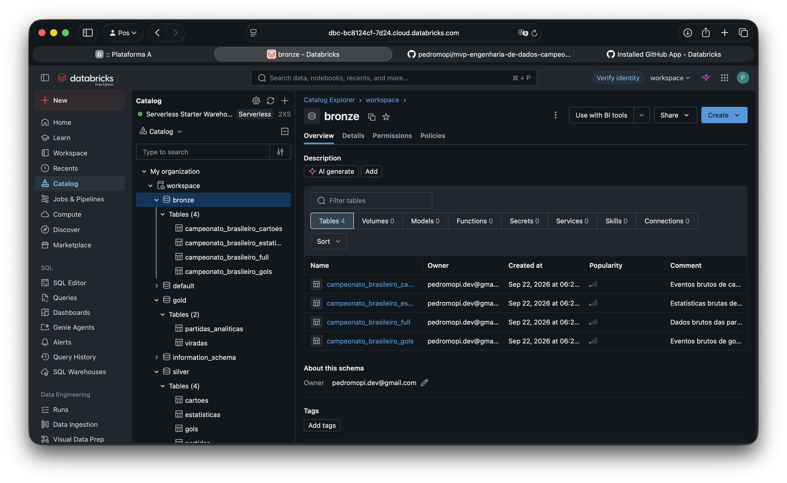

*Camada Bronze no Catalog Explorer, com as quatro tabelas carregadas.*

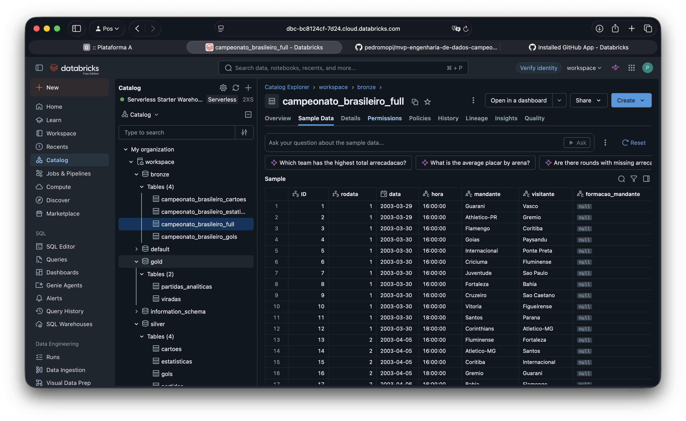

*Amostra dos dados brutos persistidos no Databricks.*

### Validação da carga

A existência das tabelas foi verificada com:

```sql
SHOW TABLES IN workspace.bronze;
```

As propriedades de armazenamento podem ser verificadas, por exemplo, com:

```sql
DESCRIBE DETAIL workspace.bronze.campeonato_brasileiro_full;
DESCRIBE EXTENDED workspace.bronze.campeonato_brasileiro_full;
```

O primeiro comando apresenta `format = delta`; o segundo identifica a tabela como `Type = MANAGED` e `Provider = delta`. A ausência de Volumes foi confirmada por:

```sql
SHOW VOLUMES IN workspace.bronze;
```

As contagens da carga foram conferidas com a consulta abaixo:

```sql
SELECT 'campeonato_brasileiro_full' AS tabela, COUNT(*) AS registros
FROM workspace.bronze.campeonato_brasileiro_full
UNION ALL
SELECT 'campeonato_brasileiro_gols', COUNT(*)
FROM workspace.bronze.campeonato_brasileiro_gols
UNION ALL
SELECT 'campeonato_brasileiro_cartoes', COUNT(*)
FROM workspace.bronze.campeonato_brasileiro_cartoes
UNION ALL
SELECT 'campeonato_brasileiro_estatisticas_full', COUNT(*)
FROM workspace.bronze.campeonato_brasileiro_estatisticas_full;
```

Contagens esperadas para a versão 18:

| Tabela Bronze | Registros esperados | Validação no Databricks |
|---|---:|---|
| `campeonato_brasileiro_full` | 9.165 | Validada |
| `campeonato_brasileiro_gols` | 10.820 | Validada |
| `campeonato_brasileiro_cartoes` | 20.953 | Validada |
| `campeonato_brasileiro_estatisticas_full` | 18.330 | Validada |

Os notebooks exportados preservam as saídas das contagens e validações. As capturas deste documento evidenciam a persistência e o processamento no ambiente em nuvem.

## Modelagem e catálogo de dados

Na camada Gold, optei por um modelo direto: cada linha de `partidas_analiticas` representa uma partida e reúne resultado, estatísticas dos dois clubes e informações do primeiro gol. Isso facilita a comparação entre mandante e visitante. A tabela `viradas` é um recorte dessa base com os jogos em que o vencedor sofreu o primeiro gol.

O catálogo completo, com origem, granularidade, tipos, descrições, domínios e linhagem, está em [`docs/catalogo_dados.md`](docs/catalogo_dados.md). O notebook `05_catalogo_dados.ipynb` registra as mesmas descrições nas tabelas e colunas do Unity Catalog.

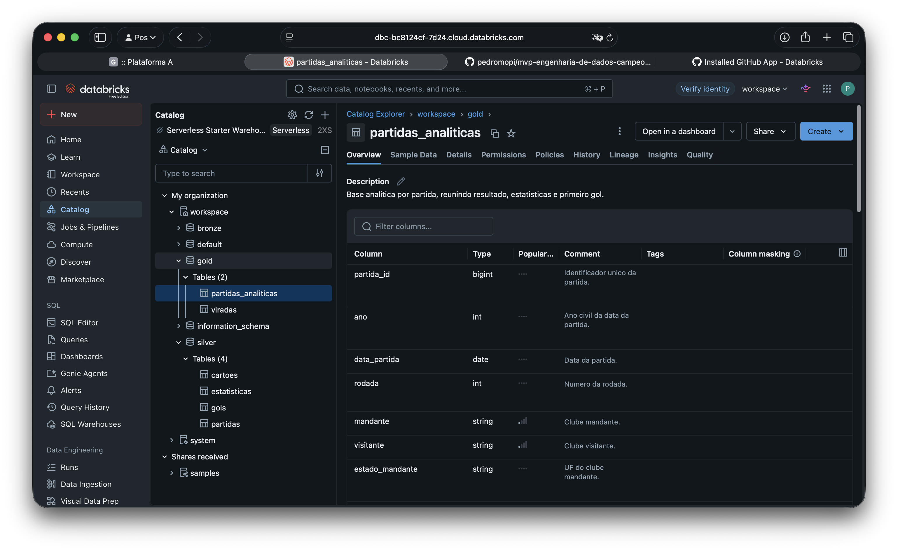

*Descrição da tabela `partidas_analiticas` e de suas colunas no Unity Catalog.*

## Pipeline

O notebook [`notebooks/01_bronze_para_silver.ipynb`](notebooks/01_bronze_para_silver.ipynb) faz a limpeza inicial, valida as chaves e grava as quatro tabelas no schema `workspace.silver`.

O notebook [`notebooks/02_qualidade_silver.ipynb`](notebooks/02_qualidade_silver.ipynb) verifica chaves, relacionamentos, campos principais, cobertura temporal e reconciliação dos gols com os placares.

O notebook [`notebooks/03_silver_para_gold.ipynb`](notebooks/03_silver_para_gold.ipynb) cria `workspace.gold.partidas_analiticas` e `workspace.gold.viradas`. A execução manteve as 9.165 partidas, não gerou IDs duplicados e identificou 418 viradas.

O notebook [`notebooks/04_analises_finais.ipynb`](notebooks/04_analises_finais.ipynb) responde às cinco perguntas de negócio usando as tabelas Gold.

O notebook [`notebooks/05_catalogo_dados.ipynb`](notebooks/05_catalogo_dados.ipynb) documenta as dez tabelas e suas colunas no Unity Catalog. A execução foi concluída sem erros e confirmou as descrições e os tipos registrados no Databricks.

### Principais transformações

| Transformação | Por que foi feita | Impacto |
|---|---|---|
| Conversão de datas, números e percentuais | Os CSVs misturam texto e valores numéricos | As colunas passaram a ter tipos adequados para validações e cálculos |
| Uso de `try_cast` em campos sujeitos a valores inválidos | Alguns campos contêm `None` ou texto no lugar de números | Valores inválidos viraram nulos sem interromper o pipeline |
| Padronização de nomes, espaços e estados | Evitar diferenças causadas por formatação | Junções entre partidas, clubes e estatísticas ficaram consistentes |
| Separação do minuto base e dos acréscimos | Minutos como `45+2` não podem ser ordenados diretamente | Foi criada uma coluna numérica para identificar a ordem dos eventos |
| Criação do resultado da partida | A fonte informa placares e vencedor, mas a análise precisa da perspectiva do mando | Cada jogo foi classificado como vitória do mandante, visitante ou empate |
| Junção das estatísticas de mandante e visitante | As estatísticas chegam em duas linhas por partida | A Gold passou a ter uma linha por jogo, com os dois clubes lado a lado |
| Identificação do primeiro gol e das viradas | Responder às perguntas sobre vantagem inicial e reação | Foram criados indicadores de primeiro gol, vitória de quem marcou primeiro e virada |
| Registro da versão e do horário de processamento | Saber qual base foi usada e quando o processo rodou | A Silver registra a versão da fonte e ambas as camadas registram quando foram processadas |

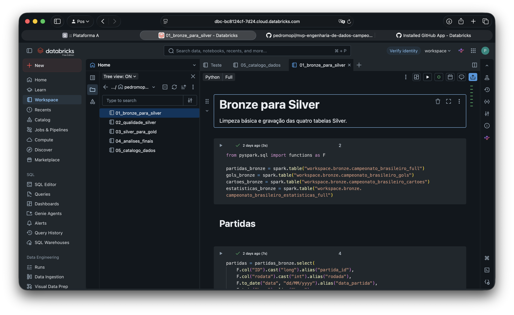

*Notebooks do pipeline armazenados e executados no workspace do Databricks.*

### Tabelas resultantes

| Camada Silver | Camada Gold |
|---|---|
| 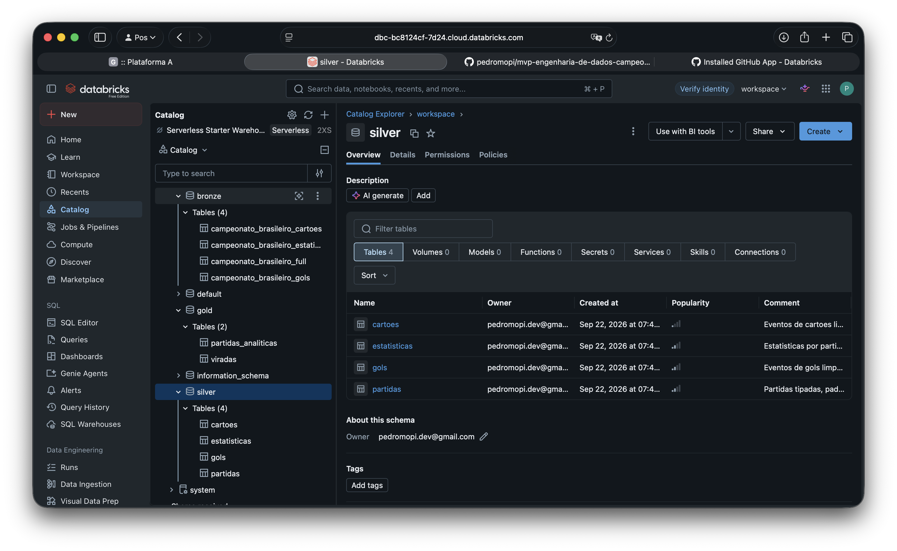 | 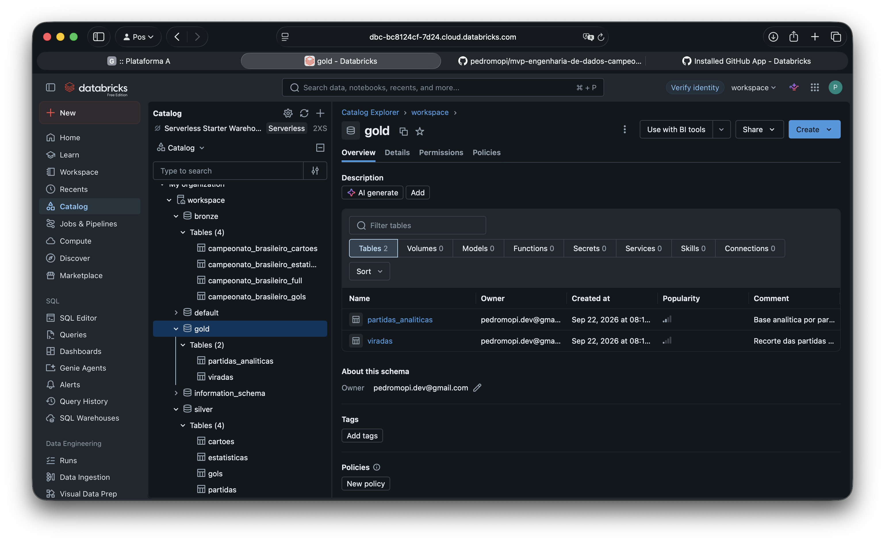 |

As quatro tabelas Silver mantêm a separação original entre partidas, gols, cartões e estatísticas, agora com os dados limpos e tipados. A Gold contém a base por partida e o recorte de viradas.

## Qualidade dos dados

As verificações não encontraram IDs duplicados, registros sem partida correspondente, partidas com quantidade incorreta de linhas de estatísticas ou diferenças entre os eventos de gols e os placares. Também conferi campos obrigatórios, valores negativos, percentuais fora do intervalo de 0 a 100 e minutos inválidos.

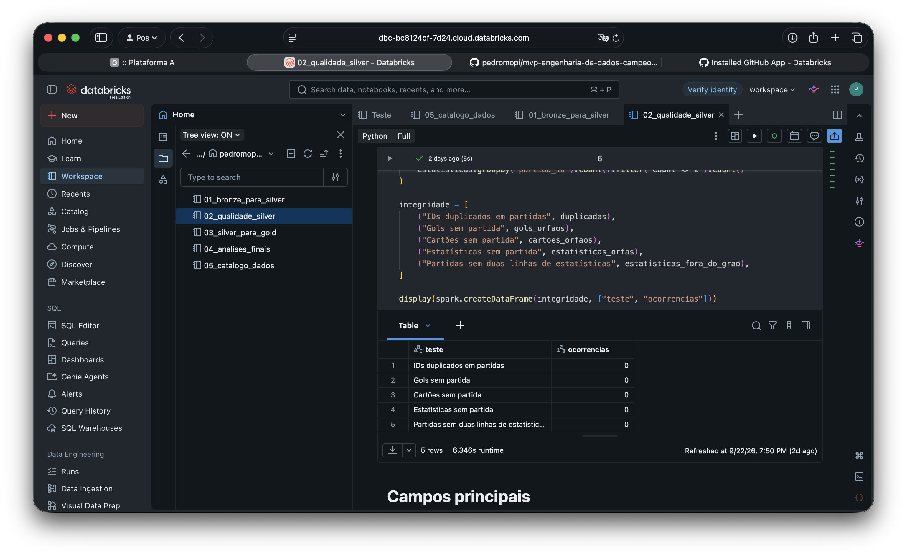

*Testes de unicidade, integridade referencial e granularidade sem ocorrências.*

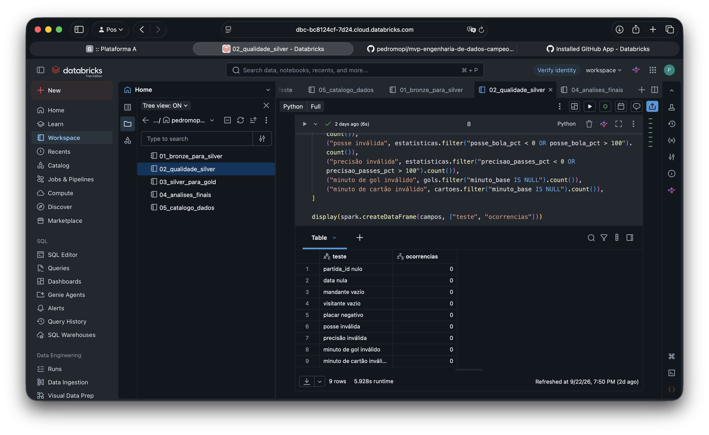

*Testes de completude, domínio e plausibilidade dos principais atributos.*

### Cobertura das estatísticas

As estatísticas não estão disponíveis da mesma forma em todos os anos. A posse de bola está ausente entre 2003 e 2013 e também em 2024. Há cobertura parcial em 2014, 2017, 2019, 2020 e 2025, enquanto a precisão dos passes só aparece a partir de 2018. Por isso, as análises de posse e escanteios usam apenas partidas em que a comparação é possível.

### Valores extremos

Usei o intervalo interquartil para procurar outliers, com o limite superior `Q3 + 1,5 × IQR`. A verificação incluiu gols, chutes, chutes no alvo, passes, faltas, cartões, impedimentos e escanteios. Considerei somente linhas com estatísticas disponíveis, para não tratar ausências preenchidas com zero como dados reais.

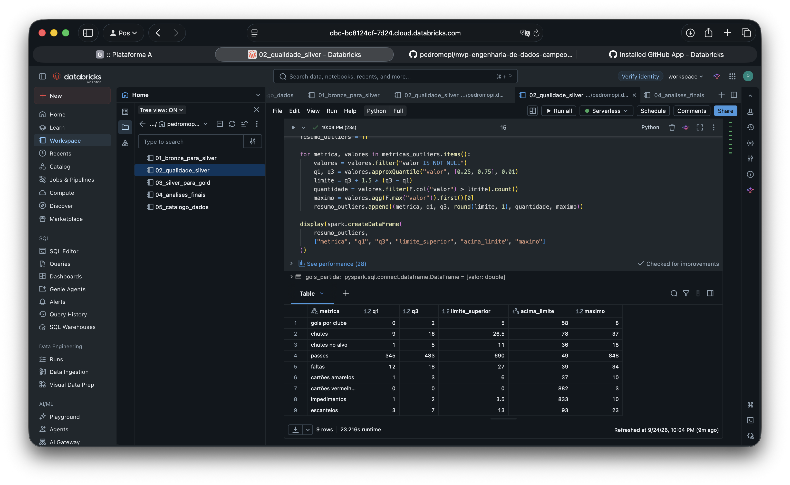

*Limites estatísticos, quantidade de ocorrências acima do limite e máximos observados.*

Os maiores valores permaneceram em faixas possíveis para uma partida, como oito gols por clube, 37 chutes, 848 passes, 34 faltas e 23 escanteios. Por isso, foram mantidos. No caso dos cartões vermelhos, como `Q1` e `Q3` são iguais a zero, qualquer ocorrência é classificada como extrema pelo método, representando raridade e não necessariamente erro.

## Análise dos dados

### 1. Times mandantes vencem mais?

Sim. Entre 29/03/2003 e 07/12/2025, os mandantes venceram 49,6% das 9.165 partidas. Os visitantes venceram 23,9% e os outros 26,4% terminaram empatados. Na base analisada, jogar em casa veio acompanhado de uma frequência bem maior de vitórias.

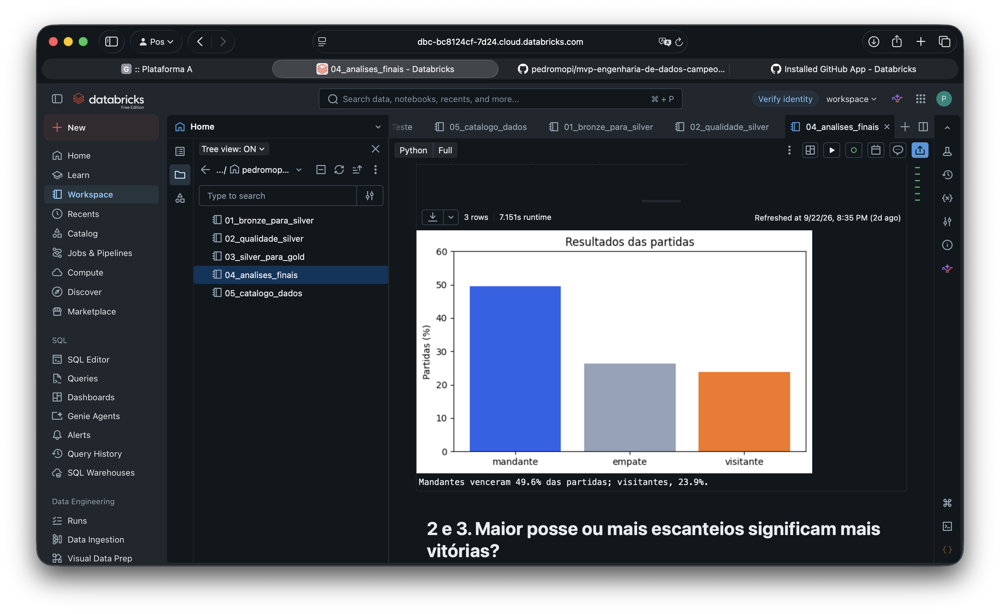

### 2. Maior posse de bola significa mais vitórias?

Não nesta base. Em 3.768 partidas comparáveis, o time com maior posse venceu 33,0%, empatou 26,7% e perdeu 40,3%. A amostra cobre jogos com a métrica disponível entre 03/08/2014 e 07/12/2025, sem registros comparáveis em 2024. Ter mais posse, sozinho, não veio acompanhado de mais vitórias.

### 3. Mais escanteios significam mais vitórias?

Também não. Em 3.458 partidas comparáveis, o time com mais escanteios venceu 35,7%, empatou 26,6% e perdeu 37,8%. O período disponível é o mesmo da posse e também não possui jogos comparáveis em 2024. A diferença é pequena, mas as derrotas ainda foram mais frequentes que as vitórias.

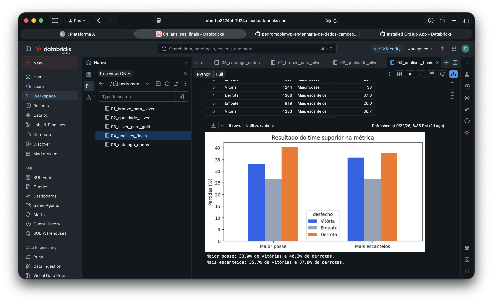

### 4. Quem marca o primeiro gol vence mais?

Sim. Entre 19/04/2014 e 07/12/2025, foi possível identificar sem ambiguidade o primeiro gol de 4.171 partidas. Quem marcou primeiro venceu 70,1%, empatou 19,9% e perdeu de virada em 10,0%. A vitória foi cerca de sete vezes mais frequente que a derrota de virada. Foi o resultado mais forte entre as perguntas analisadas.

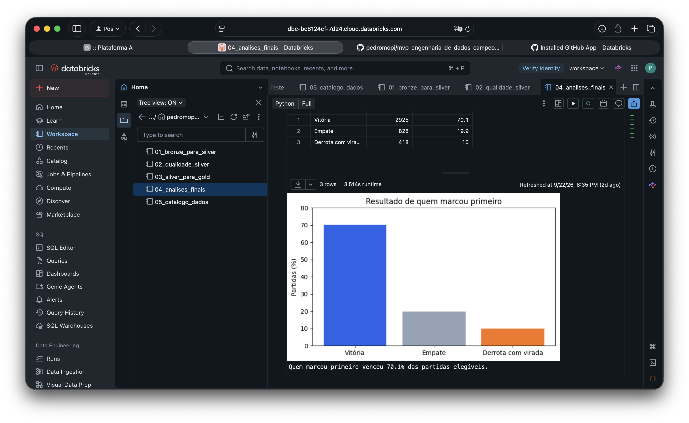

### 5. O Vasco é o time da virada do Rio?

Não no período analisado. O Flamengo liderou em quantidade, com 29 viradas, e também em aproveitamento após sofrer o primeiro gol, com 17,6%. O Vasco teve 10 viradas e taxa de 6,6%, ficando atrás de Flamengo, Fluminense e Botafogo. A comparação considera somente partidas com o primeiro gol identificado entre 2014 e 2025.

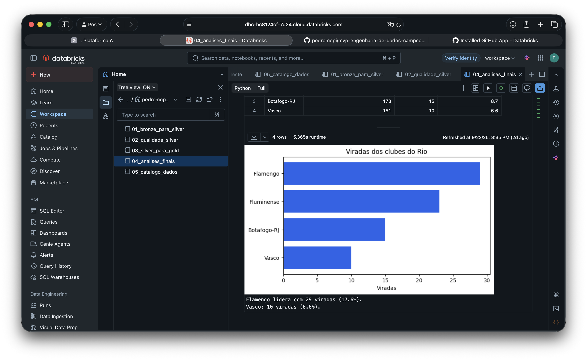

## Discussão integrada

Os resultados mostram que o contexto da partida teve uma relação maior com a vitória do que o volume de jogo. Os mandantes venceram bem mais que os visitantes, e marcar primeiro foi o resultado mais forte: quem abriu o placar venceu 70,1% das partidas elegíveis.

Posse de bola e escanteios não seguiram o mesmo padrão. As equipes superiores nessas métricas perderam um pouco mais do que venceram. Ter a bola ou acumular escanteios, sozinho, não foi suficiente para indicar maior chance de vitória.

A análise das viradas mostra como reverter um placar é difícil: somente 10,0% das equipes que sofreram o primeiro gol conseguiram vencer. Entre os clubes do Rio, o Flamengo liderou tanto em quantidade quanto em taxa de viradas. Nesse recorte, a fama de time da virada não ficou com o Vasco.

Esses resultados representam associações observadas na base. Não é possível atribuir o resultado somente ao primeiro gol, ao mando ou às estatísticas, pois fatores como qualidade dos elencos, adversários e momento das equipes não foram controlados.

## Autoavaliação

Eu trabalho com análise de dados em um grande ERP, quase sempre com análises voltadas às áreas financeira e de crédito. Por isso, quis buscar um tema diferente e aproveitar a oportunidade para sair um pouco do que vejo no dia a dia. Procurei uma base no Kaggle e, quando encontrei os dados de futebol, achei uma boa oportunidade para testar algumas crenças comuns sobre o esporte.

Eu mesmo acreditava que o Vasco seria o time com mais viradas, mas o resultado foi outro. É importante considerar que o estudo cobre um recorte específico da história do clube e somente o Campeonato Brasileiro.

Também aproveitei para conhecer o Databricks, uma ferramenta cada vez mais usada pelo mercado e que já está presente na empresa em que trabalho. Como ainda trabalho bastante com sistemas antigos, tive pouco contato com ela até aqui. A facilidade de organizar tabelas, notebooks e catálogo no mesmo ambiente me surpreendeu positivamente.

Considero que atingi os objetivos que defini: trabalhar com dados diferentes dos que costumo analisar, aprender uma ferramenta nova, construir o pipeline em camadas e responder às perguntas propostas.

A principal limitação foi a cobertura dos dados ao longo do tempo. Algumas variáveis, como posse de bola e outras estatísticas das partidas, só foram preenchidas nos anos mais recentes e ainda apresentam lacunas. Lidar com essa diferença de cobertura também fez parte do aprendizado, pois é uma situação comum em projetos reais.

Como continuação, seria possível testar a relação de outras variáveis com o resultado, como cartões, horário e formação das equipes. Outra possibilidade seria incluir no pipeline uma coleta própria em uma fonte oficial, permitindo atualizações a cada rodada sem depender do ciclo de atualização do dataset utilizado.


## Estrutura atual

```text
.
├── notebooks/
│   ├── 01_bronze_para_silver.ipynb
│   ├── 02_qualidade_silver.ipynb
│   ├── 03_silver_para_gold.ipynb
│   ├── 04_analises_finais.ipynb
│   └── 05_catalogo_dados.ipynb
├── docs/
│   ├── catalogo_dados.md
│   └── screenshots/
├── scripts/
│   └── download_dataset.py
├── .gitignore
├── README.md
└── requirements.txt
```
